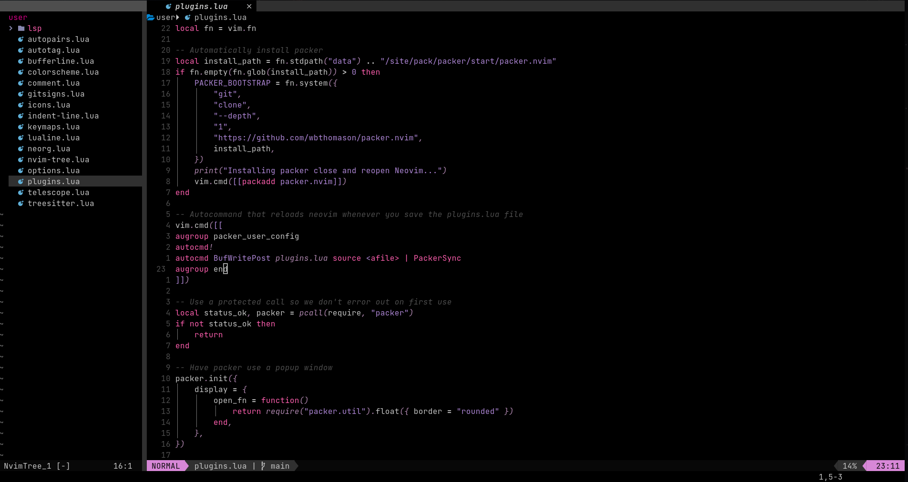

## What is this

A repo for maintaining my development environment heavily customised to my preference.

## What is in here

`Alacritty` - terminal emulator  
`Nvim` - text editor  
`zsh` - shell  
`tmux` - terminal window manager  
`ideavimrc` - custom vim bindings forintelliji ide  
`install.sh` - small bash script to install required tools and set up configs with simlinks

## Neovim

I use Nvim v0.8.2, my config is in lua and has several plugins for a smoother experiences while coding

This is how my nvim looks, colorscheme is [viola-vim](https://github.com/ElPatatone/viola-vim) which I made from forking [paramount](https://github.com/owickstrom/vim-colors-paramount).
